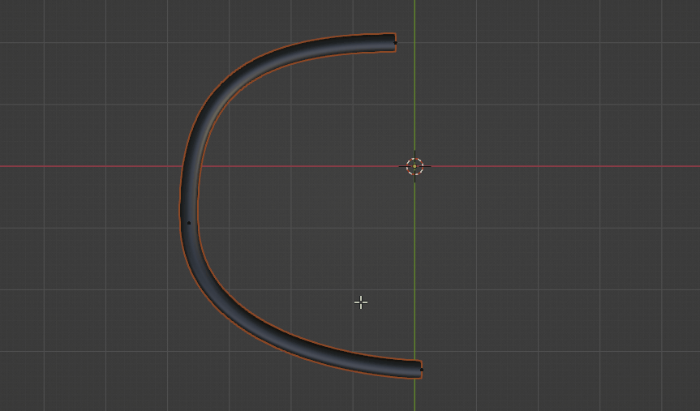
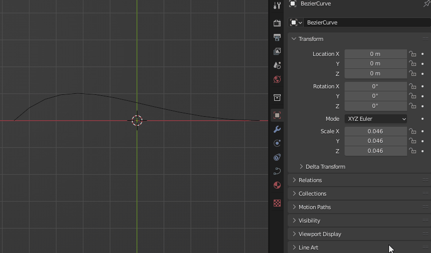

# Harness Tools
Harness Tools is a Blender addon for creating and managing cables in designs. It also provides a way to visualize any cable segments that violate minimum bend radius requirements - ideal for routing coaxial cables.

# Installation
 - Download the [latest release]().
 - From Blender, go to *Preferences > Add-ons*, click the *Install...* button and select the downloaded zip file.

# How To Use
 - Select a Bezier curve to become a cable.
 - Go to the harness tools panel (*Preferences > Data > Harness Tools*) and click **Make cable**.
 - Adjust the cable diameter and minimum bend radius using the relevant controls.
 - Enable minimum bend checking by setting **Curvature check** to **Enable**.

# Contribution
If you would like to modify and extend this code, a recommended development environment is Visual Studio Code with the Blender Development extension by Jacques Lucke.

It is also recommend to fix Python autocomplete for the Blender libraries as shown [here](https://b3d.interplanety.org/en/another-way-to-add-code-autocomplete-when-developing-blender-add-ons-in-visual-studio-code/).

# FAQ
**Question:** Why can't I scale my cable?

**Answer:** When a curve is converted to a cable, the object scale is automatically applied locked in order to ensure the cable diameter is accurately displayed. Scaling the locations of the cable points can be done in edit mode instead.

If you need to scale the cable in Object Mode, go to the object's properties and disable the lock next to the scale parameter.